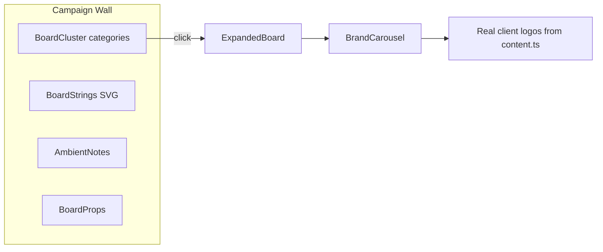
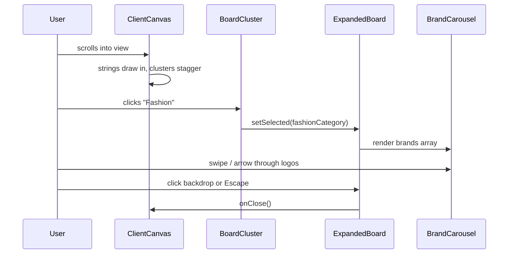

# Detective Softboard for Clients Section

## Current State

The clients section lives in [`src/sections/ClientCanvas.tsx`](src/sections/ClientCanvas.tsx) and already has the right bones: felt board texture, pinned category clusters ([`BoardCluster`](src/components/BoardCluster.tsx)), decorative props ([`BoardProps`](src/components/BoardProps.tsx)), and a modal shell ([`ExpandedBoard`](src/components/ExpandedBoard.tsx)).

**Gaps today:**
- Click handler only `console.log`s — modal never opens
- [`clientBoard.ts`](src/data/clientBoard.ts) and [`boardLayout.ts`](src/data/boardLayout.ts) are disconnected; brands are placeholders
- Board asset paths (`/board/masking.png`, polaroids, paperclips) reference files that **do not exist** in the repo
- GSAP scroll animation targets `.client-cluster` but [`BoardCluster`](src/components/BoardCluster.tsx) never adds that class
- [`StickyNote.tsx`](src/components/StickyNote.tsx) is dead code; ambient notes in [`boardDecor.ts`](src/data/boardDecor.ts) are commented out



---

## Design Direction (palette-safe detective board)

Keep existing colors from [`src/styles.css`](src/styles.css) (`--purple`, `--purple-soft`, `--accent`, cream backgrounds). Detective feel comes from **composition and copy**, not noir darkness.

| Element | Detective metaphor | Social media twist | Color |
|---|---|---|---|
| Connection strings | Case links between evidence | Category relationships (e.g. Fashion ↔ Beauty) | `--accent` / `--purple-mid` at ~40% opacity |
| Ambient sticky notes | Detective margin notes | "Caption?", "V14 😂", "Need UGC", "Trending audio" | `--purple-soft` / white |
| Polaroid frames | Photo evidence | Client logo or campaign still pinned with tape | white border + soft shadow |
| Cluster cards | Case folders | Category title + brand count | existing lavender stickies |
| Modal | Open case file | Carousel of brands in that category | cream paper, purple accents |
| Section copy | Investigation board | "Every brand is a case worth solving" tone | unchanged typography |

Add one handwritten accent font (e.g. **Caveat** via Google Fonts) for small ambient notes only — main headings stay Inter.

**Section header copy** (in `ClientCanvas.tsx`):
- Eyebrow: `Case Files`
- Title: `The Campaign Board` (or keep "The Campaign Wall" if you prefer)
- Subcopy: something like *"Clues, categories, and the brands we've helped crack the code on."*

---

## 1. Unify data: categories → real brands

Create a single source of truth in [`src/data/clientBoard.ts`](src/data/clientBoard.ts) (or a new `src/data/campaignBoard.ts`) that merges layout + brand data:

```ts
export interface CampaignCategory {
  id: string;
  title: string;
  note: string;           // ambient detective note
  sticky: { x, y, rotate, colour, size };
  photo?: { ... };
  tape?: { ... };
  clip?: { ... };
  brands: { name: string; logo: string }[];  // from content.ts imports
  connections?: string[];  // ids of related categories for strings
}
```

Extend [`src/lib/content.ts`](src/lib/content.ts) with a `category` field on each client (or a separate mapping object). Initial mapping proposal using existing + new logos in `src/assets/Client Logos/`:

- **Interiors** — Divine Space, Rearrange Home, Loka, Rachna
- **Home Décor** — Rearrange, Gilded, Plural, Eight
- **Beauty** — Aquella, Althea, Avani, Renu Saraf
- **Fashion** — Polka, Pistyle, Shagun, Tokoytori
- **Food** — Bikaneri, Nuby (expand as needed)
- **Events** — Rotary, SMF, NJP
- **Baby** — Rearrange Kids
- **Jewellery** — TO (Treasured), Rage
- **Media** — SP, JSM, Dynacons, SS

You can adjust this mapping during implementation — the structure matters more than perfect categorization on day one.

Remove duplicate [`boardLayout.ts`](src/data/boardLayout.ts) once merged, or have it re-export from the unified file.

---

## 2. Board visual upgrades

### A. Purple connection strings — new `BoardStrings.tsx`

SVG overlay inside the board container, `pointer-events-none`, drawn **behind** clusters (`z-0`).

- Curved cubic-bezier paths between category anchor points (derived from sticky `x/y` + size)
- Stroke: `var(--accent)` or `#8b5a96`, 1.5–2px, slight dash optional
- GSAP or Framer `pathLength` animation on scroll (strings "draw in" when board enters viewport)
- `connections` array in data drives which pairs get strings

### B. Re-enable ambient notes — upgrade `AmbientNote.tsx`

- Uncomment and render notes from [`boardDecor.ts`](src/data/boardDecor.ts) (update copy to social-detective tone)
- Add push-pin dot, slight rotation, handwritten font for note text
- Lower z-index than clusters so they feel like background evidence

### C. Fix / replace missing board assets

Since `/board/*` files are missing, two options (plan uses **CSS-first** to avoid blocking on asset sourcing):

- **Polaroids**: render as CSS white frames with client logo inside (no PNG dependency)
- **Tape / paperclips**: thin CSS pseudo-elements or small inline SVGs in [`BoardProps.tsx`](src/components/BoardProps.tsx)
- **Photos on clusters**: use first brand logo from that category as the polaroid "evidence" image instead of missing `Founder_photo.jpg`

Optional follow-up: add real PNG props to `public/board/` later for extra polish.

### D. Board container polish (`ClientCanvas.tsx`)

- Add subtle top-edge "cork frame" border (slightly darker `#D4CEC3`)
- Optional desk-lamp vignette using existing radial gradient, but **warm/lilac** not black
- Small corner label: `DS-CASE-2026` in uppercase tracking (decorative, low opacity)

---

## 3. Wire interactivity: cluster click → case-file modal

In [`ClientCanvas.tsx`](src/sections/ClientCanvas.tsx):

```tsx
<BoardCluster
  key={category.id}
  cluster={category}
  onClick={() => setSelected(category)}
/>
```

Pass full `CampaignCategory` (not just id) to `ExpandedBoard`.

Add `client-cluster` class to [`BoardCluster.tsx`](src/components/BoardCluster.tsx) root so existing GSAP stagger works.

---

## 4. Brand carousel inside `ExpandedBoard`

Replace the static 2-column grid in [`ExpandedBoard.tsx`](src/components/ExpandedBoard.tsx) with a new [`BrandCarousel.tsx`](src/components/BrandCarousel.tsx):

- **Layout**: one large logo card centered, prev/next arrows (lucide `ChevronLeft`/`ChevronRight`), dot indicators below
- **Motion**: Framer Motion `AnimatePresence` with horizontal slide + fade; respect `layoutId={category.id}` for open transition from sticky
- **Card design**: white evidence card, subtle paper grain, category note in italic ("Need UGC", etc.), brand name below logo
- **Keyboard**: arrow keys + Escape to close
- **Touch**: swipe on mobile via Framer drag constraints
- **Empty state**: if a category has 0 brands, show "Case open — brands coming soon"

Modal header stays case-file styled:
- Eyebrow: `Open Case`
- Title: category name
- Footer stamp: `Reviewed ✓` in purple

---

## 5. Files to create / modify

| File | Action |
|---|---|
| [`src/data/clientBoard.ts`](src/data/clientBoard.ts) | Merge layout + real brand arrays + connection pairs |
| [`src/lib/content.ts`](src/lib/content.ts) | Add all new logo imports + category mapping |
| [`src/components/BoardStrings.tsx`](src/components/BoardStrings.tsx) | **New** — SVG connection web |
| [`src/components/BrandCarousel.tsx`](src/components/BrandCarousel.tsx) | **New** — modal carousel |
| [`src/components/BoardCluster.tsx`](src/components/BoardCluster.tsx) | Use unified data; CSS polaroid; add `client-cluster` class |
| [`src/components/AmbientNote.tsx`](src/components/AmbientNote.tsx) | Handwritten font, pin, paper texture |
| [`src/components/ExpandedBoard.tsx`](src/components/ExpandedBoard.tsx) | Integrate carousel; accept full category type |
| [`src/sections/ClientCanvas.tsx`](src/sections/ClientCanvas.tsx) | Wire state, strings, notes, updated copy |
| [`src/data/boardDecor.ts`](src/data/boardDecor.ts) | Refresh note positions/copy |
| [`src/styles.css`](src/styles.css) | Import Caveat; optional `.board-string` utility |
| [`src/data/boardLayout.ts`](src/data/boardLayout.ts) | Deprecate / re-export from unified data |
| [`src/data/boardAssets.ts`](src/data/boardAssets.ts) | Replace broken PNG refs with CSS/SVG props |

**Cleanup (optional, low priority):** delete unused [`StickyNote.tsx`](src/components/StickyNote.tsx) and commented [`Clients.tsx`](src/sections/Clients.tsx) marquee version.

---

## 6. Interaction flow



---

## 7. Testing checklist

- Board renders all 9 categories with no broken image requests in Network tab
- Purple strings connect intended pairs without overlapping cluster text
- Click any cluster → modal opens with smooth `layoutId` transition
- Carousel cycles through all brands; arrows, dots, swipe, and keyboard all work
- Modal closes on backdrop click and Escape
- GSAP `.client-cluster` stagger fires on scroll
- Mobile: board scrolls horizontally or scales down gracefully (`min-h` + responsive sticky positions)
- Lighthouse: no layout shift from missing assets
